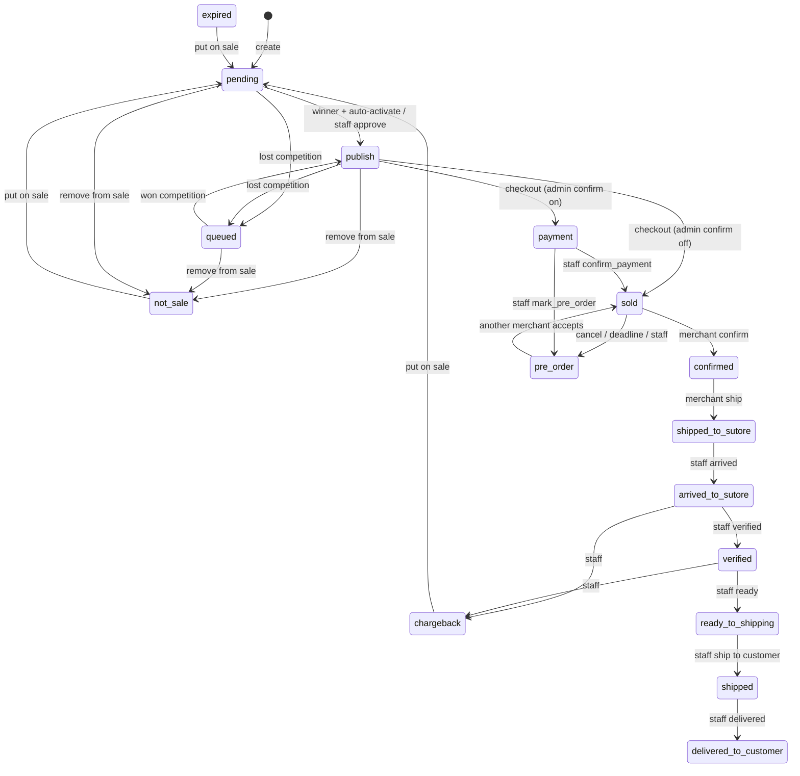

# Sutore Marketplace — Akışlar

Bu belge eklentinin **nasıl çalıştığını** anlatır: kimlik modeli, durumlar, her ürün/sipariş/satıcı akışı, fiyat, REST, cron ve tablolar. Mimari özet için [README.md](README.md). Tıklanabilir panel senaryoları için [TESTING.md](TESTING.md).

Kaynak gerçek: `listings.listing_status` tek doğruluk kaynağıdır (`ListingStatus`). Ayrı fulfillments tablosu yoktur. Kampanya, outlet ve payout ayrı alanlardır; listing status değildir.

---

## İçindekiler

1. [Kimlik ve roller](#1-kimlik-ve-roller)
2. [Tek lineer ürün durumu](#2-tek-lineer-ürün-durumu)
3. [Pazar: listing oluşturma ve kuyruk](#3-pazar-listing-oluşturma-ve-kuyruk)
4. [Vitrin ve sepet fiyatı](#4-vitrin-ve-sepet-fiyatı)
5. [Kampanya](#5-kampanya)
6. [Outlet](#6-outlet)
7. [Müşteri fiyat teklifi](#7-müşteri-fiyat-teklifi)
8. [Katalog ürün talebi](#8-katalog-ürün-talebi)
9. [Checkout](#9-checkout)
10. [Satış / lojistik pipeline](#10-satış--lojistik-pipeline)
11. [Ön sipariş (sourcing)](#11-ön-sipariş-sourcing)
12. [Payout ve e-Arşiv fatura](#12-payout-ve-e-arşiv-fatura)
13. [Satıcı: seviye, davranış, kısıt, referral](#13-satıcı-seviye-davranış-kısıt-referral)
14. [Görevler (opportunities)](#14-görevler-opportunities)
15. [Bildirim, SMS, webhook, İYS](#15-bildirim-sms-webhook-iys)
16. [OTP ve hesap silme](#16-otp-ve-hesap-silme)
17. [REST yüzeyi](#17-rest-yüzeyi)
18. [Cron ve kuyruklar](#18-cron-ve-kuyruklar)
19. [Tablolar ve ayarlar](#19-tablolar-ve-ayarlar)
20. [Sınıf haritası](#20-sınıf-haritası)

---

## 1. Kimlik ve roller

### Listing kimliği

`wp_sutore_marketplace_listings` satırının **birincil anahtarı** WooCommerce varyasyon ID’sidir: `variation_id`.

| Konuşma dili | Gerçek değer |
|---|---|
| listing id | `variation_id` |
| REST `/listings/{id}`, `/fulfillments/{id}`, `/sourcing/{id}` | aynı `variation_id` |
| payout satırı | `UNIQUE KEY variation_id` |
| sipariş kalemi bağlama | `$item->get_variation_id()` → listing |

Ayrı `listings.id` veya `fulfillment_id` yoktur. `FulfillmentRepository` listings üzerine ince facade’dır: okumada `id = variation_id`, `fulfillment_status = listing_status`.

Katalog ürünü WooCommerce **variable parent**’tır. Satıcı listing oluşturunca eklenti o parent altında yeni bir `WC_Product_Variation` üretir (draft, stok 1, author = satıcı). Görseller katalog parent’tan gelir; satıcı foto yüklemez.

Aynı parent + aynı beden (`size_term_id`) üzerinde birden fazla listing yarışır. Vitrinde satın alınabilir olan yalnızca **kazanan + `publish`** varyasyondur.

### Roller

| Rol | Kim | Yüzey |
|---|---|---|
| Müşteri | WooCommerce müşteri | Mağaza, sepet, checkout, My Account → My offers / Notifications |
| Satıcı (`merchant`) | Listing yöneten kullanıcı | My Account satıcı menüleri |
| Staff | `manage_woocommerce` (shop_manager, administrator) | My Account staff menüleri + wp-admin Sutore Marketplace |
| Sistem | Cron / Action Scheduler / WC hook | Deadline, expire, SMS, fatura kuyruğu |

### My Account endpoint’leri

Satıcı (`MerchantAccount`):

| Endpoint | Menü msgid | Ne işler |
|---|---|---|
| `listings` | My products | Listing CRUD, satışa koy/çıkar, confirm/ship, bulk |
| `sourcing` | Pre-order | Ön sipariş board (Confirmed / Super) |
| `campaign-offers` | Campaign offers | Kampanya teklifi kabul / red |
| `price-offers` | Customer offers | Müşteri fiyat teklifi kabul / red |
| `outlet` | Outlet | Pencere kalemine opt-in / iptal |
| `merchant-area` | Merchant exclusive | Profil, seviye, skor, davet kodu |
| `balance` | My Balance | Komisyon + hak edişler |
| `tasks` | Opportunities | Görev kartları |
| `notifications` | Notifications | Panel bildirimi |

Müşteri (`CustomerAccount`): `my-offers`, `notifications`.

Staff (`StaffAccount`): `manage-products`, `manage-orders`, `merchants`, `catalog-product-requests`.

Şablonlar yalnızca kabuk + spinner’dır. Liste/detay JS ile REST’ten gelir (`admin-ajax` yok).

---

## 2. Tek lineer ürün durumu

Sınıf: `Modules\Listings\Domain\ListingStatus`. Kolon: `listings.listing_status`.

Kampanya **status değildir** (`campaign_status`: `none` | `offer` | `active`). Payout **status değildir** (`merchant_payout_lines.payout_status`). Ön sipariş ayrı tablo değildir (`listing_status = pre_order` + `order_id`).

### Pazar (satış öncesi)

| Key | Anlam |
|---|---|
| `pending` | Kazanan veya yeni kayıt; auto-activate yoksa staff onayı bekler |
| `publish` | Vitrinde satışta (kazanan) |
| `queued` | Aynı bedende yarışıyor, kazanan değil |
| `expired` | Süre / outlet penceresi bitti |
| `not_sale` | Satıcı veya staff satıştan çıkardı; hub reject sonrası da buraya gelebilir |
| `order_detached` | Siparişten koptu / kaynak bulunamadı; yeniden satmak için **yeni listing** gerekir |
| `pre_order` | Açık ön sipariş; müşteri siparişine bağlı |

### Satış / hub pipeline

| Key | Anlam |
|---|---|
| `payment` | Ödeme alındı; staff ödeme onayı bekleniyor |
| `sold` | Satıcı onayı bekleniyor |
| `confirmed` | Satıcı onayladı; Sutore’a kargo süresi işliyor |
| `shipped_to_sutore` | Satıcı hub’a kargoladı |
| `arrived_to_sutore` | Hub’a geldi |
| `verified` | Hub doğruladı; **payout satırı burada doğar** |
| `ready_to_shipping` | Müşteriye kargoya hazır |
| `shipped` | Müşteriye kargolandı (`sutore_shipment_code` zorunlu) |
| `delivered_to_customer` | Teslim; `delivered_at` + iade penceresi |
| `chargeback` | İade / chargeback (terminal satış durumu; relistable) |

### Kilitler ve kümeler

- **Düzenleme / silme kilitli** (`isProcessLocked`): satış pipeline **veya** `pre_order` **veya** `order_id !== null`.
- **Satıştan çıkarılabilir:** `publish`, `queued`, `pending`.
- **Yeniden satışa konabilir:** `not_sale`, `expired`, `chargeback`. `order_detached` relistable **değildir**.
- **Payout açılabilir:** `verified` … `delivered_to_customer`.
- **Müşteri e-Arşiv bekler** (`invoiceOpen`): `payment`, `sold`, `confirmed`, `shipped_to_sutore`, `arrived_to_sutore`, `pre_order`.
- **Erken sipariş iptali listing’i serbest bırakır:** `payment`, `sold`, `confirmed`, `pre_order`. `shipped_to_sutore` ve sonrası staff işidir.



Müşteri sipariş ekranındaki etiketler iç durumdan farklıdır (`customerLabel`): `payment` / `sold` / `pre_order` müşteriye “Pending Seller Confirmation” okunur; `chargeback` → “Returned”.

---

## 3. Pazar: listing oluşturma ve kuyruk

**Servis:** `ListingService`. **Sıralama:** `ListingSelector::rerunSize`. **Politika:** `ListingPolicy`.

### Oluşturma (`POST /listings`)

1. Rol + yasak kontrolü (`listing_create_ban`, `disabled_account`).
2. Asking doğrulama (`ListingPriceValidator`, adım `listingPriceStep`).
3. Parent + beden/renk ekseni (`ProductSizeLookup`). Çoklu eksende beden; yalnızca renk varsa renk; tek term (One Size) otomatik seçilir.
4. Yeni WC varyasyon (draft, stok 1).
5. `listings` satırı: `listing_status=pending`, `campaign_status=none`, `expire_at` süreye göre.
6. Kusur bayrakları `listing_conditions` (`no_box`, `box_damaged`, `missing_accessory`, `damaged`).
7. Event `listing_created` → `ListingSelector::rerunSize`.

Süre seçenekleri: **2 / 7 / 30 / 45 / 60** gün (`ListingDuration::ALLOWED_DAYS`), seviye tavanı `listingDurationMaxByLevel` ile kesilir.

Staff başka satıcı adına oluşturabilir (`merchant_id`). `is_imported` işaretli listing’lerde onay/kargo deadline cron’u atlanır.

### Düzenleme / silme

- Parent ve beden oluşturma sonrası kilitlidir.
- Satış/ön sipariş/sipariş bağlıysa güncelleme yok.
- Bekleyen kampanya teklifi tüm güncellemeyi kilitler; aktif kampanyada asking **yalnızca düşürülebilir**.
- Canlı outlet listing kilitlidir (fiyat, süre, satıştan çıkarma, silme).
- `price_update_ban` fiyat değiştirmeyi engeller.
- Silme: sipariş/process/outlet yoksa conditions + listing + varyasyon force-delete, sonra kuyruk yeniden.

### Satışa koy / çıkar

- Çıkar: `publish|queued|pending` → `not_sale`, kuyruk yeniden.
- Koy: `not_sale|expired|chargeback` → `pending`, sipariş alanları temizlenir, kuyruk yeniden.

### Kuyruk (fiyat yarışı)

Aynı `parent_product_id` + `size_term_id` ve status `publish|queued|pending` olanlar yarışır.

Sıralama (`ListingConditionRank`): **en düşük `asking` kazanır; eşitlikte daha eski `created_at`**. Kusur rozeti kuyruk sırasını **değiştirmez** (yalnızca vitrin / fingerprint).

Kazanan:

- `is_winner=1`
- Auto-activate seviyesi (`auto_active_merchant_statuses`, varsayılan `verified,premium`) → `publish` + WC varyasyon publish/instock
- Aksi halde `pending` (staff `approve`)
- Diğerleri `queued`, WC draft/outofstock

Olaylar: `queue_position_changed`, `listing_went_on_sale`, `listing_left_sale`. Bildirim: `LISTING_WINNER_GAINED` / `LISTING_WINNER_LOST`.

Form önizlemesi: `GET /form-context` (rakip fiyatlar Confirmed/Super ve staff’a).

### Toplu yükleme

`/listings/bulk/template` → validate → commit. Action Scheduler `sutore_marketplace_bulk_import_batch`. Event `listing_bulk_import`.

---

## 4. Vitrin ve sepet fiyatı

**SoT canlıdır:** WC `_price` alanında asking saklanır; müşterinin gördüğü tutar listing + ayarlardan her seferinde hesaplanır (`MarketplacePricing`, `PdpIntegration`, `CartPricingHooks`). Fee değişince `pricing_revision` cache’i bozar.

### Normal listing

```
müşteri birim = asking + hizmetBedeli + (asking × güvenceBedeli%) − platform_waiver
```

- `hizmetBedeli` — sabit TL (`service_fee_amount`)
- `güvenceBedeli` — asking yüzdesi (`assurance_fee_percent`)
- `platform_waiver` — yalnızca `campaign_status=active`; tavan = hizmet + güvence (asking’in altına inilmez). Önce hizmetten, sonra güvenceden düşülür.

Üstü çizili / karşılaştırma fiyatı: kampanyasızda `asking + tam fee`; kampanyada teklifin `compare_regular` veya indirim öncesi asking + fee.

### Outlet

Canlı outlet listing’de müşteri fiyatı `outlet_items.customer_sale` (asking + fee formülü kullanılmaz). Satıcı asking’i `seller_net` (yuvarlanmış).

### Sepet kuralları

- PDP adet 1’e kilitli (`CartQuantityHooks`).
- Sepet üst sınırı `cart_max_quantity` (varsayılan 8).
- Gençlik indirimi: negatif sepet ücreti; `youth_discount_enabled`, yaş `youth_discount_max_age` (26), yüzde `youth_discount_percent` (20). Checkout’ta doğum yılı / TCKNO eşiği `checkout_tckno_cart_total_threshold`.
- Kondisyon: `ProductConditionHooks` — PDP rozeti, sepet satırı “Condition”, Store API extension.

---

## 5. Kampanya

Tablolar: `campaigns`, `campaign_offers`. Listing kolonları: `campaign_status`, `campaign_id`, `campaign_cooled_until`, `campaign_aging_step`.

### Pencere durumları

`draft` → `active` → `ended` (`CampaignStatus`).

Teklif durumları: `pending` | `accepted` | `declined` | `expired`.

### Admin (wp-admin Campaigns + `/admin/campaigns*`)

1. Taslak oluştur, hedef önizle (`preview`).
2. `publish` → uygun listing’lere teklif fan-out (`campaign_status=offer`, event `campaign_offer_sent`).
3. Manuel teklif: listing `publish` veya `queued` ve `campaign_status=none` olmalı.
4. `endCampaign` → kabul edilmişlerde asking restore + cooldown; bekleyen teklifler expire.

### Satıcı

- Liste / kabul / red: `/campaign-offers`, `/campaign-offers/{id}/accept|decline`.
- **Kabul:** asking satıcı indirimi kadar düşer, `campaign_status=active`, WC sale senkronu (`CampaignWcSaleSync`), platform waiver, `campaign_applied`, kuyruk yeniden.
- **Red:** `campaign_status=none`.
- Satıcı kendi kampanyasını başlatabilir: `POST /listings/{id}/campaign` (yüzde + gün, otomatik kabul).

Bekleyen teklif listing güncellemeyi kilitler. Aktif kampanyada asking artırılamaz. Bittiğinde `campaign_cooled_until` dolana kadar yeni teklif yok.

Sistem yaşlandırma: `CampaignCronHooks` (`sutore_marketplace_campaign_expiry`, 5 dk) aday `publish/queued` + `campaign_status=none` listing’lere kademeli teklif üretir.

Kampanya, müşteri fiyat teklifi ve outlet ile karışmaz.

---

## 6. Outlet

Tablolar: `outlet_windows`, `outlet_items`, `outlet_optins`.

Pencere: `draft` | `scheduled` | `active` | `ended`.  
Opt-in: `pending` | `live` | `cancelled` | `expired`.

### Admin

Kalem = parent + beden + `customer_sale` (müşteri) + `seller_net` (satıcı asking).  
`publish`: başlangıç gelmemişse `scheduled`, gelmişse hemen `active`. Açılışta bekleyen opt-in’ler için listing üretilir.  
`end` / cron: satılmayan canlı listing `ListingService::expire`, opt-in `expired`. Asking restore **yok**.

### Satıcı (`GET /outlet`, `POST /outlet/{itemId}/opt-in`)

- Pencere `scheduled` veya `active` iken katılınır.
- Pencere henüz açılmamışsa opt-in `pending` kalır (iptal edilebilir).
- Pencere `active` ise listing hemen oluşur: asking = yuvarlanmış `seller_net`, `expire_at` = pencere sonu, `force_publish`.
- Canlı outlet listing kilitli (`ListingOutletPolicy`).

---

## 7. Müşteri fiyat teklifi

Tablo: `customer_offers`. Kampanya offer’ına dokunmaz (`campaign_status` değişmez, vitrin fiyatı değişmez).

Durumlar: `pending` | `accepted` | `declined` | `expired` | `cancelled`.

Guardrail (`CustomerOfferGuardrails`): açık/kapalı, asking’in min yüzdesi (varsayılan %70), günlük tavan (10), yanıtsız auto-decline saati, kabul kuponu TTL.

### Müşteri (`/my-offers`)

- Yalnızca **`publish` kazanan** listing’e; teklif asking’den düşük ve min % üstü; kampanya meşgul değil; aynı parent+bedende tek pending; kendi listing’ine yok.
- İptal: kendi pending → `cancelled`.
- Context (PDP): `GET /my-offers/context?variation_id=` (logged-in; seller `asking` not exposed).

### Satıcı (`/price-offers`)

- **Kabul** (`publish` veya `queued`): kişiye özel WC kupon. Tutar = `listingComparePrice(asking) − listingComparePrice(bid)`. Kupon meta: `_sutore_mp_customer_offer_id`, `_sutore_mp_customer_offer_listing`. Vitrin asking aynı kalır.
- **Red / timeout:** `declined`, sonra **şelale** `forwardToNextSeller` — aynı bedende bir sonraki (daha pahalı / kuyruk) listing’e yeni pending satır (`origin_offer_id`).

### Checkout (`CustomerOfferCheckoutHooks`)

- Kupon yalnızca kabul etmiş kullanıcıya aittir.
- Kupon uygulanınca ilgili listing sepete eklenir; sepete ekleyince kabul kuponu otomatik uygulanır.
- Kabul edilmiş (süresi dolmamış) teklif, o müşteri için draft varyasyonu satın alınabilir tutabilir (kuyruktaki satıcının ürünü).

Cron: `sutore_marketplace_customer_offer_tick` (5 dk) — expire + auto-decline.

---

## 8. Katalog ürün talebi

Tablo: `catalog_product_requests`. Durumlar: `pending` | `fulfilled` | `rejected` | `cancelled`.

Kim talep eder: listing yönetebilen + create/disable yasağı yok + seviye `catalog_product_request_levels` içinde (varsayılan `verified,premium`). New seviye ve banlı satıcı butonu görmez.

Satıcı: SKU/link + beden notu + isteğe bağlı not; en fazla **10** pending; aynı SKU/link için ikinci pending yok. Pending iptal edilebilir.

Staff (My Account Catalog requests): **Mark added** (`fulfill`, isteğe bağlı published variable `parent_product_id`) veya **Decline**. Eklenti WooCommerce ürünü **oluşturmaz**. Bildirim: `CATALOG_REQUEST_FULFILLED` / `REJECTED`.

---

## 9. Checkout

HTTP: classic `update_checkout` + Blocks Store API (`/wc/store/v1/cart`). Özel checkout-total Ajax yok.

### Kargo (`Modules\Shipping`)

WC method id: `sutore_marketplace`. Tipler (`ShipmentType`): `free`, `fast`, `express`, `international`, `cyprus`, `imported_free`. Siparişe yazılır: `listings.order_shipment_type` + `order_shipment_deadline_at`.

Ücret / ETA anahtarları ana ayarlarda (`checkout_fast_shipping_fee`, `checkout_express_base_fee`, `checkout_express_per_item_surcharge`, `checkout_international_fee`, `checkout_cyprus_fee`, `checkout_free_fast_cart_threshold`, …). Classic ve Blocks ayrı JS.

### Kupon (`Modules\Coupons`)

Uygulama/kaldırma WooCommerce native (`apply_coupon` / `remove_coupon`).  
Lockout: başarısız deneme `coupon_lockout_max_attempts` (5) / `coupon_lockout_minutes` (15).  
Marka kampanyası kupon meta: `_sutore_mp_brand_campaign`, min adet, bildirim rengi/önceliği.  
Sepet bildirim limiti `coupon_cart_notice_limit`.

### Sözleşmeler (`Modules\Contracts`)

Ön bilgilendirme + mesafeli satış. Locale’e göre şablon (`*-en.php` / TR gövde). Zorunlu checkbox. Sipariş snapshot meta `_sutore_marketplace_contracts_snapshot`: `accepted_at`, `pre_information`, `distance_sales`, `version`.

### Ödeme → satış başlangıcı

`WooCommerceHooks` → `PaymentHandler::startMarketplaceSale`.

Tetik: `woocommerce_payment_complete` ve `processing` / `on-hold` (COD/BACS `payment_complete` atlayabilir). Idempotent: sipariş meta `_sutore_mp_sale_started`.

Her kalem: varyasyon → listing (kazanan `publish` veya kabul edilmiş müşteri teklifiyle satın alınabilir `queued`). `FulfillmentService::onPaymentComplete`:

- `order_id`, `order_item_id`
- `require_admin_payment_confirm` açıksa `payment`, değilse `sold` + confirm deadline
- `sold_at`, kargo tipi snapshot
- Komisyon kilitlenir (`CommissionResolver::lockForSale` → `sale_commission_percent`)
- Varyasyon draft/OOS, kuyruk yeniden

Kalem fiyat meta (`OrderItemPricingMetaHooks`): `_sutore_mp_asking`, `_sutore_mp_hizmet_bedeli`, `_sutore_mp_guvence_bedeli`, `_sutore_mp_platform_waiver`, `_sutore_mp_customer_unit`.

---

## 10. Satış / lojistik pipeline

**Servis:** `FulfillmentService`. Staff UI: Manage Products. Satıcı aksiyonları: Ürünlerim listesi (`marketplace-listings.js` → `/fulfillments/{id}/confirm|ship`).

### Mutlu yol (varsayılan: admin ödeme onayı açık)

```
ödeme
  → payment
  → staff confirm_payment → sold          (confirm_deadline_at)
  → satıcı confirm → confirmed            (cargo_deadline_at)
  → satıcı ship + takip no → shipped_to_sutore
  → staff arrived → arrived_to_sutore
  → staff verified → verified             (payout satırı pending)
  → staff ready → ready_to_shipping
  → staff ship to customer + sutore kodu → shipped
  → staff delivered → delivered_to_customer
```

Siparişteki tüm marketplace kalemler `delivered_to_customer` olunca WC sipariş `completed`.

### Satıcı aksiyonları

| REST | From → To | Koşul |
|---|---|---|
| `POST /fulfillments/{id}/confirm` | `sold` → `confirmed` | `seller_confirmed_at`, kargo süresi |
| `POST /fulfillments/{id}/ship` | `confirmed` → `shipped_to_sutore` | `shipment_code` ayar regex’i (`^\d{12}$` varsayılan) |
| `POST /fulfillments/{id}/cancel` | `sold` → `pre_order` | `seller_cancelled` |

Toplu confirm: listings bulk `confirm_sale`.

### Staff aksiyonları (`POST /fulfillments/{id}/actions`)

| Action | Etki |
|---|---|
| `confirm_payment` | `payment` → `sold` |
| `swap` | Siparişte satıcı/listing değiştir (`new_variation_id`); fiyat farkı sipariş meta |
| `attach_to_order` | Pazar listing’ini işleyen siparişe bağla |
| `split` (UI: detach) | Siparişten çıkar → `order_detached` (yalnızca `payment/sold/confirmed`) |
| `mark_arrived` | `shipped_to_sutore` → `arrived_to_sutore` |
| `mark_verified` | `arrived_to_sutore` → `verified` + payout create |
| `mark_ready_to_ship` | `verified` → `ready_to_shipping` |
| `mark_shipped_to_customer` | `ready_to_shipping` → `shipped` |
| `mark_delivered` | `shipped` → `delivered_to_customer` + `return_window_ends_at` |
| `mark_pre_order` | `payment/sold` → `pre_order` |
| `close_pre_order` | Kaynak yok: kalem iade/kaldır, `order_detached` |
| `hub_reject` | `not_sale`, payout reverse, detach |
| `chargeback` | `chargeback`, payout reverse, detach (`arrived_to_sutore` ve sonrası) |
| `mark_not_for_sale` | `order_detached` |
| `mark_payout_paid` | Payout `paid` → satıcı komisyon faturası kuyruğu |
| `approve` / `put_on_sale` / `remove_from_sale` / `delete_listing` | Pazar işlemleri |
| `adjust_commission` / `set_listing_commission` | Komisyon |
| `mark_imported` / `unmark_imported` | Import bayrağı |

Not zorunlu aksiyonlar: `detach`, `close_pre_order`, `mark_not_for_sale`, `remove_from_sale`, `chargeback`.

Bulk: `POST /fulfillments/bulk-actions` (swap / müşteri kargo / pre_order / chargeback yok).

Staff kuyruk filtreleri: `yellow_zone`, `red_zone`, `awaiting_merchant`.

### Deadline cron (`sutore_marketplace_fulfillment_deadlines`)

Ayar: `deadline_cron_schedule` (varsayılan `twicedaily`). Import listing atlanır.

| Alan | Ne zaman | Cron |
|---|---|---|
| `confirm_deadline_at` | `sold`’a giriş | 1. tur: hatırlatma + `confirm_grace_hours` uzatma. 2. tur: `pre_order` + `confirm_punished` |
| `cargo_deadline_at` | satıcı confirm | `cargo_reminder_hours` kala hatırlatma; sürede `cargo_expired_flag` (status **değişmez**) |

Süreler: `confirm_deadline_hours` (seviye override `*_verified` / `*_premium`), kargo `cargo_deadline_hours_standard|express|international`. İş günü opsiyonu `use_business_days_for_deadlines`.

İade penceresi teslimde başlar (`return_window_days`, varsayılan 14). Pencere bitince otomatik status değişimi **yok**. Chargeback staff aksiyonudur. WC `refunded` yalnızca SMS gönderir; listing’i otomatik chargeback yapmaz.

### WooCommerce sipariş iptali

`cancelled`: `payment/sold/confirmed/pre_order` → `order_detached`. `shipped_to_sutore` ve sonrası durur; admin SMS `order_cancelled_open_fulfillment`.

### Manage Orders

REST `/admin/orders*`: liste, detay, status, bulk status, attach adayları, attach, kalem sil.  
Attach kuralı: `processing/completed` → listing `sold` + satıcı “satıldı” SMS; `pending/on-hold` → `payment` (satıldı SMS yok).

---

## 11. Ön sipariş (sourcing)

Ayrı talep tablosu yok. Board = `listing_status=pre_order` ve `order_id` dolu listing’ler.

### Açılış

- Staff `mark_pre_order`
- Satıcı `sold` iken iptal
- Confirm deadline 2. tur (`confirm_punished`)

Duyuru: hedefli SMS + digest cron `sutore_marketplace_sourcing_digest` (twicedaily). Tekrar önleme option `sutore_marketplace_pre_order_digest_sent_ids`. Fiyat toleransı `sourcing_price_tolerance_percent` (varsayılan %10).

### Kim görür

`ListingPolicy::canAccessSourcingBoard`: Confirmed / Super. Yaptırım açıksa skor ≥ `behavior.sourcing_min_score`.  
Görünürlük: Super hemen; Confirmed `sourcing_early_access_hours` (24s) sonra. New seviye menüyü görmez.

### Kabul (`POST /sourcing/{id}/accept`)

Mevcut listing yeniden kullanılırsa `asking` talep fiyatına çekilir (UI bunu confirm’de gösterir). **Anında sipariş swap** (`FulfillmentService::acceptPreOrderSwap`). Staff `fulfilled` adımı yok.

Event: `listing_pre_order`, `pre_order_accepted`, `sourcing_fulfilled`. Webhook: `pre_order.accepted`.

Kaynak bulunamazsa staff `close_pre_order`: listing `order_detached`, ödenmişse kalem refund, müşteri SMS `pre_order_unsourced_customer`; başka açık kalem yoksa sipariş `cancelled`.

---

## 12. Payout ve e-Arşiv fatura

### Hak ediş

Tablo: `merchant_payout_lines`. Durum: `pending` | `paid` | `reversed`.

Oluşum: staff **verified**. Tutar asking (veya kabul edilmiş müşteri teklifi bid) − fee − kilitli komisyon. `scheduled_payout_date` = `payout_min_hold_days` (7) + `payout_weekdays` (varsayılan Çarşamba). Ayrı payout cron’u yok; tarih satırda dondurulur.

Staff `mark_payout_paid` → `paid` → `InvoiceIssuer::queueSellerCommission`.  
Hub reject / chargeback → `reversed`.

Satıcı UI: `GET /merchant/balance`. Staff CSV: `GET /fulfillments?export=csv`.

### Paraşüt e-Arşiv

Tablo: `invoices`. Tür: `customer_fees` (sipariş, `variation_id=0`) | `seller_commission` (listing).  
Durum: `queued` → `processing` → `waiting_job` / `waiting_pdf` → `sent` | `skipped` | `error`.

**Müşteri faturası** sipariş kapanınca kesilir: açık `invoiceOpen` kalem kalmamalı; faturalanan kalemler `verified`…`delivered` (veya düşenler hiç yazılmaz). Hizmet + güvence kalemleri. 0 TL satır yok. Gençlik indirimi kesim anında kalan kalemlere hizmet → güvence → komisyon sırasıyla bölünür. PDF müşteri billing e-postasına. **İade/credit faturası yok** — sonraki chargeback mevcut e-Arşiv’i iptal etmez.

**Satıcı komisyon faturası** payout `paid` olunca listing başına. PDF satıcı profil e-postasına.

Satış ve payout fatura hatasında **durmaz**; cron `sutore_marketplace_invoice_queue` (her dakika) + Action Scheduler `sutore_marketplace_process_invoice` yeniden dener.

PDF: `GET /invoices/{id}/pdf` — staff, ilgili satıcı (komisyon) veya sipariş müşterisi (hizmet/güvence). Dosyalar document root dışında (`dirname(ABSPATH)/sutore-private/invoices` veya `SUTORE_MARKETPLACE_PRIVATE_DIR`); public uploads URL yok (`InvoiceStorage`). Nginx altında ayrıca `location ^~ /sutore-private/` ve `location ^~ /wp-content/sutore-private/` deny edilmelidir.

Ayar: Settings → Invoices + token option `sutore_marketplace_parasut_tokens`. Seed varsayılan kapalı.

---

## 13. Satıcı: seviye, davranış, kısıt, referral

Profil tablosu: `merchant_profiles` (PK `user_id`). REST: `/merchant/profile`, `/merchant/districts`, `/merchant/behavior`, `/merchant/balance`.

### Seviyeler (`MerchantLevels`)

| DB `merchant_status` | UI | Varsayılan komisyon |
|---|---|---|
| `normal` | New | %15 |
| `verified` | Confirmed | %12 |
| `premium` | Super | %8 |

TC kimlik doğrulama (`tckno_verified`) seviyeden ayrıdır.

Komisyon çözümü (`CommissionResolver`): `level` | `listing` | `override`. Override kaynakları: `staff`, `task`, `campaign`, `referral`. Satış anında `sale_commission_percent` kilitlenir. Platform geneli override: `merchant_id = 0`.

Kısıtlar (`merchant_restrictions`): `listing_create_ban`, `price_update_ban`, `disabled_account`.

### Davranış skoru

Ayar iç içe `behavior`: pencere günü, event ağırlıkları, Confirmed/Super eşikleri (min skor, satış adedi, ciro), sourcing min skor, new-seller koruması, shadow mode, growth görev kademeleri.

Günlük cron `sutore_marketplace_behavior_daily` (~03:00). Staff event reverse: `POST /admin/behavior/events/{id}/reverse`.

### Referral

Ayrı cüzdan yok. Davet kodu profilde; komisyon etkisi **süreli override**. Davet edilen ilk `sold` olunca davet edene ödül (üst sınır `inviter_max_rewards_per_period`). Kendi kodunu kullanmak kayıtta reddedilir.

Staff satıcı UI: My Account Sellers (`/admin/merchants*`). wp-admin’de ayrı Sellers sayfası yok.

---

## 14. Görevler (opportunities)

Tablolar: `task_definitions`, `merchant_task_progress`, `merchant_rewards`.

Aileler: `recovery`, `growth`, `engagement`. Şablonlar: `growth_monthly_sales`, `recovery_timely_confirm`, `engagement_sourcing`, `engagement_campaign`.

İlerleme otomatik (`TaskProgressService`) — listing / satış / sourcing / kampanya olayları. Tamamlanınca isteğe bağlı komisyon ödülü + `task.completed` bildirimi.

REST: `GET /tasks/dashboard`. Admin: wp-admin Tasks & Rewards + `POST /admin/tasks/definitions`. Debug’ta `POST /admin/tasks/progress`.

---

## 15. Bildirim, SMS, webhook, İYS

### Panel

Tablo: `merchant_notifications`. Tek giriş: `NotificationService::dispatch` → panel insert + (kanal açıksa) SMS + `do_action('sutore_marketplace_notification_push')` (push henüz yok).

REST: `GET /notifications`, unread-count, `{id}/read`, `read-all`.  
Kanal matrisi fulfillment ayarında: `merchant_notification_channels` (panel + sms). Push rezerv.

### SMS

Fan-out SMS `SmsQueue` → `outbound_effects` outbox → Action Scheduler `sutore_marketplace_process_effect`. Simulation modunda effect aynı istekte işlenir (shutdown runner yok). Provider false sonucu effect’i `pending`/`failed` yapar; başarılı teslim `done`.

NetGSM: `netgsm_usercode`, `netgsm_password`, `netgsm_header`, `netgsm_encoding`, `sms_simulation_mode`.

Müşteri/admin şablonları `Orders\Settings\SmsTemplates` (ödeme, confirm, kargo, teslim, ön sipariş, sipariş iptal/iade, …). Satıcı olayları `NotificationType` → aynı şablon haritası (ör. `sale.received` → `seller_confirm_request`).

### Webhook

`webhook_url` + `webhook_secret` (HMAC `X-Sutore-Signature`). Body’de `event_id`; header `X-Sutore-Event-Id`. Gönderim outbox üzerinden; yalnız HTTP 2xx success sayılır. Örnekler: `fulfillment.sold`, `fulfillment.confirmed`, `fulfillment.delivered_to_customer`, `fulfillment.chargeback`, `listing.pre_order`, `pre_order.accepted`, `payout.paid`.

### İYS

Hook: `sutore_marketplace_marketing_opt_in` / `opt_out` → `IysConsentService` → outbox (`effect_type=iys`) → worker `IysClient::submit` (`ONAY`/`RET`). `netgsm_brand_code` boşsa veya simülasyon açıksa API çağrılmaz; rıza yerelde saklanır (`marketing_consent`). Hesap silmede RET outbox’a yazılır.

---

## 16. OTP ve hesap silme

REST (`OtpController`): `GET /otp/config`, `POST /otp/request`, `PUT /account/details`, `PUT /account/password`, `DELETE /account`.

Amaçlar: `merchant_profile`, `account_details`, `password_change`, `account_delete`.  
Ayar: `otp_enabled`, TTL, deneme, rate limit, kod uzunluğu, SMS şablonu `{code}`.

Hesap silme blokları (`AccountDeletionService`):

- `payment` … `shipped` arası açık satış
- Açık `pre_order`
- Teslim edilmiş ama payout’u `paid` olmayan satırlar

Market listing’ler (`publish/queued`) silinir, kuyruk yenilenir. Teslim / chargeback satırları ve event/payout izi kalır. Başarıda e-posta + telefon İYS RET.

---

## 17. REST yüzeyi

Namespace: `sutore-marketplace/v1`. Auth: cookie + `X-WP-Nonce` (Application Passwords uyumlu). `permission_callback` zorunlu.

Müşteri mağaza: `/wc/store/v1/*`, `/wc/v3/*`, `/wp/v2/*`. Plugin domain’i native WC resource’a gömülmez; native alan varsa `ExtendSchema` / `register_rest_field`.

### Satıcı / müşteri

| Metod | Yol | Kim |
|---|---|---|
| GET | `/search-parents`, `/sizes/{parent_id}`, `/form-context` | Satıcı |
| GET/POST | `/listings` | Satıcı |
| GET/PUT/PATCH/DELETE | `/listings/{id}` | Sahip / staff |
| POST | `/listings/{id}/put-on-sale`, `…/remove-from-sale`, `…/campaign` | Sahip |
| GET/POST | `/listings/bulk-*` | Satıcı |
| GET | `/listings/{id}/activity` | Sahip / staff |
| GET | `/campaign-offers` | Satıcı |
| POST | `/campaign-offers/{id}/accept\|decline` | Satıcı |
| GET | `/outlet` | Satıcı |
| POST | `/outlet/{itemId}/opt-in`, `/outlet/optins/{id}/cancel` | Satıcı |
| GET/POST | `/catalog-product-requests` | Satıcı |
| POST | `/catalog-product-requests/{id}/cancel` | Satıcı |
| GET/POST | `/my-offers` | Müşteri |
| GET | `/my-offers/context` | Logged-in customer |
| POST | `/my-offers/{id}/cancel` | Müşteri |
| GET | `/price-offers` | Satıcı |
| POST | `/price-offers/{id}/accept\|decline` | Satıcı |
| GET | `/sourcing`, `/sourcing/{id}` | Satıcı (seviye) |
| POST | `/sourcing/{id}/accept` | Satıcı |
| GET/POST | `/fulfillments/{id}/confirm\|ship\|cancel` | Satıcı (owner) |
| GET/PUT | `/merchant/profile` | Satıcı |
| GET | `/merchant/districts`, `/merchant/behavior`, `/merchant/balance` | Satıcı |
| GET/POST | `/notifications*` | Satıcı / müşteri |
| GET | `/tasks/dashboard` | Satıcı |
| GET | `/otp/config` | Oturum |
| POST | `/otp/request` | Oturum |
| PUT | `/account/details`, `/account/password` | Oturum |
| DELETE | `/account` | Oturum |
| GET | `/invoices/{id}/pdf` | Staff / ilgili satıcı / sipariş müşterisi |

### Staff

| Alan | Yollar |
|---|---|
| Fulfillments | `GET /fulfillments`, `GET /fulfillments/{id}`, `POST …/actions`, `…/swap-candidates`, `POST /fulfillments/bulk-actions`, `GET /admin/processing-orders` |
| Orders | `GET/POST /admin/orders*`, attach, bulk-status |
| Merchants | `GET/PUT /admin/merchants`, `POST …/status`, commission-override, restrictions |
| Campaigns | `GET/POST /admin/campaigns*`, preview, publish, end, offers |
| Outlet | `GET/POST /admin/outlet-windows*`, items, publish, end |
| Catalog | `GET /admin/catalog-product-requests`, `POST …/fulfill\|reject` |
| Listings | `POST /admin/listings/{id}/approve\|remove-from-sale`, DELETE, activity |
| Behavior | `POST /admin/behavior/events/{id}/reverse` |
| Tasks | `POST /admin/tasks/definitions` |
| Coupons | `POST /admin/coupons/seed-brand` |

---

## 18. Cron ve kuyruklar

| Hook | Aralık | İş |
|---|---|---|
| `marketplace_check_expired_listings` | hourly | Süre dolan listing `expired` |
| `sutore_marketplace_fulfillment_deadlines` | ayar (`twicedaily`) | Confirm / kargo deadline |
| `sutore_marketplace_campaign_expiry` | 5 dk | Kampanya yaşlandırma / bitiş |
| `sutore_marketplace_outlet_tick` | 5 dk | Pencere aç/kapa |
| `sutore_marketplace_customer_offer_tick` | 5 dk | Teklif expire / auto-decline |
| `sutore_marketplace_sourcing_digest` | twicedaily | Ön sipariş SMS özeti |
| `sutore_marketplace_behavior_daily` | daily ~03:00 | Skor, seviye, aylık kartlar |
| `sutore_marketplace_invoice_queue` | her dakika | Fatura kuyruğu |
| `sutore_marketplace_process_invoice` | AS | Tek fatura işi |
| `sutore_marketplace_process_effect` | AS | SMS / webhook / İYS outbox |
| `sutore_marketplace_effects_retry` | hourly | Due effect yeniden deneme |
| `sutore_marketplace_purge_old_events` | daily | `event_retention_days` cleanup |
| `sutore_marketplace_bulk_import_batch` | AS | Toplu listing |

---

## 19. Tablolar ve ayarlar

Şema sürümü: `Schema::VERSION` = 102 (production baseline; historical migrators removed). Option: `sutore_marketplace_db_version`. Prefix: `{wpdb}sutore_marketplace_`. Table registry: `Schema::tableSuffixes()`. Listing satırında `last_operation_id` (STATE-01 idempotency).

**STATE-01:** `ListingRepository::transition(...)` → `TransitionResult` (`changed` / `already_done` / `conflict`). Claim, pre-order claim, fulfillment `advanceStatus` / intervention bu primitive’i kullanır. Webhook outbox dedupe: `webhook:{event}:{operation_id}`.

**FulfillmentService:** ince facade; komutlar `PaymentReservationCommands`, `MerchantFulfillmentCommands`, `StaffFulfillmentCommands`, `SourcingSwapCommands`, `PayoutCommands` (+ `FulfillmentCommandSupport`).

**UI-01:** tek HTTP helper `SutoreMarketplace.request(method, path, opts)`; staff/admin/PDP yerel ajax/fetch bu helper’a bağlanır.

| Tablo | Amaç |
|---|---|
| `listings` | Ürün + satış/lojistik SoT (PK `variation_id`) |
| `listing_conditions` | Kusur bayrakları |
| `listing_events` | Aktivite / davranış girdileri |
| `campaigns` / `campaign_offers` | Kampanya pencereleri ve teklifler |
| `outlet_windows` / `outlet_items` / `outlet_optins` | Outlet |
| `customer_offers` | Müşteri fiyat teklifi + kupon bağı |
| `customer_offer_daily_counters` | Günlük teklif kotası (atomik) |
| `catalog_product_requests` | Katalog talep kuyruğu |
| `merchant_profiles` | Profil, seviye, skor, referral, rıza |
| `merchant_restrictions` | Yasaklar |
| `merchant_commission_overrides` | Süreli komisyon |
| `merchant_payout_lines` | Hak ediş |
| `merchant_notifications` | Panel inbox |
| `merchant_events` | Satıcı audit |
| `task_definitions` / `merchant_task_progress` / `merchant_rewards` | Görevler |
| `invoices` | Paraşüt kuyruğu |
| `outbound_effects` | SMS / webhook / İYS outbox |

Uninstall varsayılan olarak tabloları **korur**; drop için `SUTORE_MARKETPLACE_PURGE_ON_UNINSTALL` gerekir. Table registry: `Schema::tableSuffixes()`.

### Option’lar

| Option | İçerik |
|---|---|
| `sutore_marketplace_settings` | Fiyat, seviye, sepet, gençlik, OTP, NetGSM, kargo ücretleri, kupon, sözleşme, iç içe `behavior` / `referral` / `invoices` |
| `sutore_marketplace_fulfillment_settings` | Deadline, SMS şablon/olay, payout takvimi, satıcı bildirim kanalları, webhook, sourcing toleransı |
| `sutore_marketplace_parasut_tokens` | Paraşüt OAuth |
| `sutore_marketplace_pre_order_digest_sent_ids` | Digest tekrar önleme |
| `sutore_marketplace_behavior_monthly_run` | Son aylık davranış koşusu (`Y-m`) |

wp-admin Settings sekmeleri: Pricing, Products (listing), Behavior, Operations, SMS, Invoices, Order Flow, Shipping, Coupons, Contracts, Campaigns. Kardeş sayfalar: Campaigns, Outlet, Tasks & Rewards, Events.

---

## 20. Sınıf haritası

```
includes/Bootstrap/class-plugin.php          Modül boot
includes/Shared/Database/class-schema.php    Tablolar
includes/Shared/Settings/class-settings.php  Ana ayarlar
includes/Shared/Domain/class-marketplace-pricing.php
includes/Shared/Hooks/                       PDP, cart, youth, cron, checkout identity, IYS

includes/Modules/Listings/
  Domain/class-listing-status.php
  Services/class-listing-service.php
  Services/class-listing-selector.php
  Services/class-campaign-service.php
  Services/class-outlet-service.php
  Services/class-customer-offer-service.php
  Rest/                                      listings, bulk, campaigns, outlet, offers, catalog

includes/Modules/Orders/
  Services/class-fulfillment-service.php
  Repositories/class-fulfillment-repository.php
  Rest/class-fulfillments-controller.php
  Hooks/class-woo-commerce-hooks.php

includes/Modules/Sourcing/Services/class-sourcing-service.php
includes/Modules/Merchants/Services/         profil, bildirim, payout, restriction
includes/Modules/Tasks/
includes/Modules/Shipping/
includes/Modules/Coupons/
includes/Modules/Contracts/
includes/Modules/Invoices/Services/class-invoice-issuer.php
includes/Modules/Otp/

includes/Frontend/                           My Account endpoint + assets
includes/Admin/                              Settings, Campaigns, Outlet, Tasks, Events
```

Demo veri: `tools/seed-scenarios.php` (`--force`). Hesap tablosu: [TESTING.md](TESTING.md).
